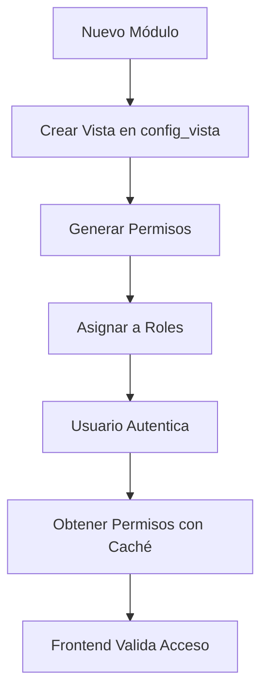
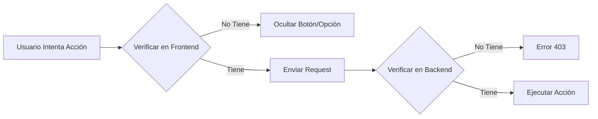

# Sistema de Permisos Milla Backend

## Documentación Completa

Bienvenido a la documentación del sistema de permisos de Milla Backend. Este sistema permite gestionar permisos granulares basados en roles para controlar el acceso a funcionalidades específicas del sistema.

---

## Estructura de Documentación

Este sistema está documentado en varios archivos especializados:

### 1. [USER_PERMISSIONS_SYSTEM.md](./USER_PERMISSIONS_SYSTEM.md)
**Para: Desarrolladores Frontend y Backend (Consulta de Permisos)**

Documentación del sistema de consulta de permisos para usuarios finales:
- API para obtener permisos del usuario autenticado
- Endpoints de verificación de permisos
- Integración con frontend (React, Vue, etc.)
- Sistema de caché
- Permisos agrupados por módulos/vistas

**Casos de Uso:**
- Verificar si un usuario puede crear una orden de compra
- Obtener lista de módulos accesibles para el menú
- Verificar permisos antes de mostrar botones de acción
- Consultar permisos de un módulo específico

### 2. [PERMISSION_MODEL_README.md](./PERMISSION_MODEL_README.md)
**Para: Administradores del Sistema y Desarrolladores Backend**

Documentación completa del modelo Permission y gestión administrativa:
- Cómo crear permisos (API, código, seeders)
- Cómo actualizar y eliminar permisos
- Asignación de permisos a roles
- Endpoints de administración
- Validaciones y estructura de datos
- Mejores prácticas

**Casos de Uso:**
- Crear permisos para un nuevo módulo
- Asignar permisos CRUD a un rol
- Sincronizar permisos entre roles
- Exportar/importar permisos
- Configurar permisos en seeders

### 3. [PERMISSION_USAGE_EXAMPLES.md](./PERMISSION_USAGE_EXAMPLES.md)
**Para: Todos los Desarrolladores**

Ejemplos prácticos de código para todas las operaciones:
- Ejemplos de creación y actualización
- Uso de scopes y filtros
- Métodos avanzados (clonado, generación automática)
- Import/Export de permisos
- Casos de uso reales
- Tests unitarios

**Casos de Uso:**
- Generar permisos CRUD automáticamente
- Clonar permisos de un módulo a otro
- Crear comandos Artisan personalizados
- Auditar permisos del sistema
- Migración de permisos entre ambientes

---

## Inicio Rápido

### Para Desarrolladores Frontend

Si necesitas **verificar permisos en tu aplicación**, consulta:
[USER_PERMISSIONS_SYSTEM.md](./USER_PERMISSIONS_SYSTEM.md)

**Endpoint principal:**
```http
GET /api/users/permissions
Authorization: Bearer {token}
```

**Respuesta:**
```json
{
  "permissions": {
    "vehicle_purchase_order.create": true,
    "vehicle_purchase_order.edit": true
  },
  "modules": [...]
}
```

**Verificar permiso en código:**
```javascript
if (permissions['vehicle_purchase_order.create']) {
  // Mostrar botón de crear
}
```

### Para Administradores del Sistema

Si necesitas **crear o administrar permisos**, consulta:
[PERMISSION_MODEL_README.md](./PERMISSION_MODEL_README.md)

**Crear permiso vía API:**
```http
POST /api/configuration/permission
Content-Type: application/json

{
  "code": "vehicle_purchase_order.create",
  "name": "Crear Orden de Compra",
  "module": "vehicle_purchase_order",
  "type": "basic"
}
```

**Asignar a un rol:**
```http
POST /api/configuration/permission/assign-to-role
Content-Type: application/json

{
  "role_id": 2,
  "permission_id": 45
}
```

### Para Desarrolladores Backend

Si necesitas **implementar permisos en código**, consulta:
[PERMISSION_USAGE_EXAMPLES.md](./PERMISSION_USAGE_EXAMPLES.md)

**Generar permisos CRUD:**
```php
use App\Models\gp\gestionsistema\Permission;

Permission::generateCrudPermissions('vehicle_movement', 25);
// Crea: view, create, edit, delete
```

**Verificar permiso en código:**
```php
if (auth()->user()->hasPermission('vehicle_purchase_order.create')) {
    // Permitir acción
}
```

---

## Arquitectura del Sistema

```
┌─────────────────────────────────────────────────────────┐
│                    SISTEMA DE PERMISOS                  │
├─────────────────────────────────────────────────────────┤
│                                                         │
│  ┌──────────────────────────────────────────────────┐  │
│  │         CAPA DE CONSULTA (Frontend)              │  │
│  │  UserPermissionController / UserPermissionService│  │
│  │  - Obtener permisos del usuario                  │  │
│  │  - Verificar permisos específicos                │  │
│  │  - Caché de permisos (1 hora)                    │  │
│  └──────────────────────────────────────────────────┘  │
│                         ↓                               │
│  ┌──────────────────────────────────────────────────┐  │
│  │     CAPA DE ADMINISTRACIÓN (Backend Admin)       │  │
│  │  PermissionController / PermissionService        │  │
│  │  - CRUD de permisos                              │  │
│  │  - Asignación a roles                            │  │
│  │  - Sincronización                                │  │
│  └──────────────────────────────────────────────────┘  │
│                         ↓                               │
│  ┌──────────────────────────────────────────────────┐  │
│  │              MODELO PERMISSION                   │  │
│  │  - Relaciones (roles, vista)                     │  │
│  │  - Scopes (active, byModule, byType)            │  │
│  │  - Métodos auxiliares                            │  │
│  └──────────────────────────────────────────────────┘  │
│                         ↓                               │
│  ┌──────────────────────────────────────────────────┐  │
│  │               BASE DE DATOS                      │  │
│  │  - permission (tabla principal)                  │  │
│  │  - role_permission (pivot)                       │  │
│  │  - config_vista (módulos/vistas)                 │  │
│  └──────────────────────────────────────────────────┘  │
│                                                         │
└─────────────────────────────────────────────────────────┘
```

---

## Flujo de Trabajo

### 1. Creación de un Nuevo Módulo



**Paso a Paso:**

1. **Crear vista en `config_vista`**
   ```sql
   INSERT INTO config_vista (descripcion, slug, ruta, icono, status_deleted)
   VALUES ('Movimientos de Vehículos', 'vehicle_movement', '/vehicles/movements', 'truck', 1);
   ```

2. **Generar permisos** (ver [PERMISSION_USAGE_EXAMPLES.md](./PERMISSION_USAGE_EXAMPLES.md))
   ```php
   Permission::generateCrudPermissions('vehicle_movement', 25);
   ```

3. **Asignar a roles** (ver [PERMISSION_MODEL_README.md](./PERMISSION_MODEL_README.md))
   ```php
   $service->assignMultiplePermissionsToRole(2, [45, 46, 47, 48]);
   ```

4. **Usuario consulta permisos** (ver [USER_PERMISSIONS_SYSTEM.md](./USER_PERMISSIONS_SYSTEM.md))
   ```http
   GET /api/users/permissions
   ```

### 2. Verificación de Permisos



**Frontend:**
```javascript
if (permissions['vehicle_purchase_order.create']) {
  // Mostrar botón crear
}
```

**Backend (Middleware):**
```php
Route::post('/vehicle-purchase-orders', [Controller::class, 'store'])
    ->middleware('permission:vehicle_purchase_order.create');
```

---

## Convenciones y Estándares

### Nomenclatura de Códigos de Permiso

```
{módulo}.{acción}

Ejemplos:
✓ vehicle_purchase_order.create
✓ opportunity.assign_consultant
✓ vehicle_movement.export

✗ CreateVehiclePurchaseOrder
✗ vpo_create
✗ vehiclePurchaseOrderCreate
```

### Tipos de Permisos

| Tipo | Descripción | Ejemplos |
|------|-------------|----------|
| **basic** | CRUD estándar | view, create, edit, delete |
| **special** | Operaciones comunes pero no CRUD | export, import, approve, reject |
| **custom** | Operaciones específicas del módulo | send_to_erp, assign_consultant, calculate_commission |

### Estructura de un Módulo Completo

```
vehicle_purchase_order/
├── CRUD Básico (basic)
│   ├── view
│   ├── create
│   ├── edit
│   └── delete
├── Operaciones Especiales (special)
│   ├── export
│   ├── approve
│   └── reject
└── Operaciones Custom (custom)
    ├── send_to_erp
    ├── cancel
    └── duplicate
```

---

## API Endpoints por Categoría

### Endpoints de Consulta (Usuario Final)
Documentación completa: [USER_PERMISSIONS_SYSTEM.md](./USER_PERMISSIONS_SYSTEM.md)

```
GET    /api/users/permissions                    - Permisos del usuario autenticado
GET    /api/users/{userId}/permissions           - Permisos de un usuario específico
GET    /api/users/permissions/module/{module}    - Permisos de un módulo
POST   /api/users/permissions/check              - Verificar permiso específico
GET    /api/modules                              - Listar módulos disponibles
POST   /api/users/permissions/clear-cache        - Limpiar caché de permisos
```

### Endpoints de Administración (CRUD Permisos)
Documentación completa: [PERMISSION_MODEL_README.md](./PERMISSION_MODEL_README.md)

```
GET    /api/configuration/permission                          - Listar permisos
POST   /api/configuration/permission                          - Crear permiso
GET    /api/configuration/permission/{id}                     - Ver permiso
PUT    /api/configuration/permission/{id}                     - Actualizar permiso
DELETE /api/configuration/permission/{id}                     - Eliminar permiso
GET    /api/configuration/permission/grouped-by-module        - Permisos agrupados
POST   /api/configuration/permission/assign-to-role           - Asignar a rol
POST   /api/configuration/permission/assigns-to-role          - Asignar múltiples
POST   /api/configuration/permission/syncPermissionsToRole    - Sincronizar
GET    /api/configuration/permission/{roleId}/getByRole       - Permisos de un rol
```

---

## Ejemplos de Uso por Rol

### Desarrollador Frontend

**Necesito:** Mostrar/ocultar botones según permisos

**Leer:**
1. [USER_PERMISSIONS_SYSTEM.md](./USER_PERMISSIONS_SYSTEM.md) → Sección "Uso en el Frontend"

**Código:**
```javascript
// Al iniciar sesión
const { data } = await axios.get('/api/users/permissions');
store.commit('setPermissions', data.permissions);

// En componente
<button v-if="permissions['vehicle_purchase_order.create']">
  Crear Orden
</button>
```

### Desarrollador Backend

**Necesito:** Crear permisos para un nuevo módulo

**Leer:**
1. [PERMISSION_MODEL_README.md](./PERMISSION_MODEL_README.md) → Sección "Cómo Crear Permisos"
2. [PERMISSION_USAGE_EXAMPLES.md](./PERMISSION_USAGE_EXAMPLES.md) → Sección "Generación Automática"

**Código:**
```php
// En Seeder
Permission::generateCrudPermissions('vehicle_movement', 25);

// Asignar a rol admin
$adminRole = Role::find(1);
$permissions = Permission::byModule('vehicle_movement')->pluck('id');
$service->syncPermissionsToRole($adminRole->id, $permissions->toArray());
```

### Administrador del Sistema

**Necesito:** Configurar permisos para un nuevo empleado

**Leer:**
1. [PERMISSION_MODEL_README.md](./PERMISSION_MODEL_README.md) → Sección "Asignación a Roles"

**Acción:**
```http
POST /api/configuration/permission/syncPermissionsToRole
{
  "role_id": 5,
  "permissions": [45, 46, 47]
}
```

### QA / Tester

**Necesito:** Verificar que los permisos funcionen correctamente

**Leer:**
1. [USER_PERMISSIONS_SYSTEM.md](./USER_PERMISSIONS_SYSTEM.md) → Sección "Ejemplos con Postman"
2. [PERMISSION_USAGE_EXAMPLES.md](./PERMISSION_USAGE_EXAMPLES.md) → Sección "Testing"

**Casos de Prueba:**
- Usuario sin permiso no puede acceder a módulo
- Usuario con permiso puede ejecutar acción
- Caché se invalida correctamente
- Permisos heredados por rol funcionan

---

## Herramientas y Comandos

### Comandos Artisan Útiles

```bash
# Crear permisos CRUD para un módulo (personalizado)
php artisan permission:generate vehicle_movement --vista-id=25

# Ejecutar seeder de permisos
php artisan db:seed --class=PermissionSeeder

# Ver permisos en consola
php artisan tinker
>>> Permission::byModule('vehicle_purchase_order')->get()
```

### Scripts de Mantenimiento

Ver ejemplos completos en [PERMISSION_USAGE_EXAMPLES.md](./PERMISSION_USAGE_EXAMPLES.md)

```php
// Auditoría: Permisos sin asignar
$unassigned = Permission::doesntHave('roles')->count();

// Limpieza: Permisos inactivos antiguos
Permission::where('is_active', false)
    ->where('updated_at', '<', now()->subMonths(6))
    ->delete();

// Backup: Exportar permisos
$permissions = Permission::all()->map->toExportArray();
file_put_contents('backup.json', json_encode($permissions));
```

---

## Troubleshooting Rápido

### Problema: Usuario no ve sus permisos

**Solución:**
1. Verificar que tenga rol asignado: `SELECT * FROM config_asig_role_user WHERE user_id = ?`
2. Verificar que el rol tenga permisos: `SELECT * FROM role_permission WHERE role_id = ?`
3. Limpiar caché: `POST /api/users/permissions/clear-cache`
4. Verificar que permisos estén activos: `is_active = 1`

Más detalles: [USER_PERMISSIONS_SYSTEM.md](./USER_PERMISSIONS_SYSTEM.md) → Troubleshooting

### Problema: No puedo crear permisos duplicados

**Solución:**
Usar `updateOrCreate` en lugar de `create`:
```php
Permission::updateOrCreate(
    ['code' => 'module.action'],
    ['name' => '...', ...]
);
```

Más detalles: [PERMISSION_MODEL_README.md](./PERMISSION_MODEL_README.md) → Troubleshooting

### Problema: Permisos no se reflejan en el frontend

**Solución:**
1. Limpiar caché del usuario
2. Volver a hacer login
3. Verificar que el endpoint devuelve los permisos correctos

Más detalles: [USER_PERMISSIONS_SYSTEM.md](./USER_PERMISSIONS_SYSTEM.md) → Troubleshooting

---

## Checklist de Implementación

### Al Crear un Nuevo Módulo

- [ ] Crear vista en `config_vista`
- [ ] Generar permisos CRUD básicos
- [ ] Crear permisos especiales si aplica
- [ ] Asignar permisos al rol administrador
- [ ] Documentar permisos custom en el README del módulo
- [ ] Agregar validación de permisos en rutas/middleware
- [ ] Agregar verificación de permisos en el frontend
- [ ] Crear tests de permisos

### Al Modificar Permisos

- [ ] Actualizar seeders
- [ ] Invalidar caché de usuarios afectados
- [ ] Actualizar documentación si cambia la estructura
- [ ] Notificar a frontend si se modifican códigos
- [ ] Ejecutar tests de integración

---

## Referencias Rápidas

### Archivos Clave

| Archivo | Descripción | Línea |
|---------|-------------|-------|
| `Permission.php` | Modelo principal | `app/Models/gp/gestionsistema/Permission.php:10` |
| `PermissionController.php` | CRUD admin | `app/Http/Controllers/gp/gestionsistema/PermissionController.php:14` |
| `UserPermissionController.php` | Consulta usuario | `app/Http/Controllers/gp/gestionsistema/UserPermissionController.php:10` |
| `PermissionService.php` | Lógica admin | `app/Http/Services/gp/gestionsistema/PermissionService.php:17` |
| `UserPermissionService.php` | Lógica consulta | `app/Http/Services/gp/gestionsistema/UserPermissionService.php:12` |

### Tablas de Base de Datos

| Tabla | Descripción |
|-------|-------------|
| `permission` | Permisos del sistema |
| `role_permission` | Asignación permisos-roles (pivot) |
| `config_vista` | Módulos/Vistas del sistema |
| `config_roles` | Roles de usuario |
| `config_asig_role_user` | Asignación usuario-rol |

---

## Soporte y Contribución

### Documentación Adicional

- **Sistema de Permisos de Usuario**: [USER_PERMISSIONS_SYSTEM.md](./USER_PERMISSIONS_SYSTEM.md)
- **Gestión de Permisos (Admin)**: [PERMISSION_MODEL_README.md](./PERMISSION_MODEL_README.md)
- **Ejemplos de Código**: [PERMISSION_USAGE_EXAMPLES.md](./PERMISSION_USAGE_EXAMPLES.md)

### Mejores Prácticas

1. **Siempre usar** nomenclatura estándar: `module.action`
2. **Invalidar caché** al modificar permisos de roles
3. **Validar en backend**, no solo en frontend
4. **Documentar permisos custom** específicos de cada módulo
5. **Usar seeders** para crear permisos en todos los ambientes

---

**Última actualización**: 24 de octubre de 2025
**Versión del Sistema**: 1.0
**Autor**: Sistema de Gestión Milla