# 📘 Manual de API - Sistema de Asistencia y Planilla

**Versión:** 1.0
**Última actualización:** 2026-02-21
**Base URL:** `http://127.0.0.1:8000/api/gp/gh/payroll`

---

## 📋 Tabla de Contenidos

1. [Conceptos Clave](#conceptos-clave)
2. [Endpoints Disponibles](#endpoints-disponibles)
3. [Modelos de Datos](#modelos-de-datos)
4. [Ejemplos de Uso](#ejemplos-de-uso)
5. [Manejo de Errores](#manejo-de-errores)
6. [Flujo Completo](#flujo-completo)

---

## 🔑 Conceptos Clave

### Sistema de Códigos de Asistencia

**NO guardamos horas trabajadas**. En su lugar, guardamos **códigos de asistencia** por día:

- `D` - Día normal (8h o 12h según trabajador)
- `N` - Noche
- `DD` - Día descanso
- `FDT`, `FNT` - Feriado día/noche turno
- `DT`, `NT` - Día/noche turno
- `LCGH` - Licencia con goce de haber
- `DM` - Día médico

### Reglas de Asistencia

Cada código tiene **reglas** en la tabla `attendance_rules`:

| Campo | Descripción |
|-------|-------------|
| `code` | Código (D, N, DD, etc.) |
| `hour_type` | DIURNO, NOCTURNO, REFRIGERIO |
| `hours` | Horas fijas (si use_shift = 0) |
| `multiplier` | Multiplicador (1.0, 1.25, 1.35, etc.) |
| `pay` | true = suma, false = resta |
| `use_shift` | true = usa horas_jornada del trabajador |

### Cálculo de Planilla

```
valor_hora_base = sueldo / 30 / horas_jornada
Si hour_type = NOCTURNO: valor_hora_base × 1.35
valor_hora × multiplicador × horas × días_trabajados
```

**Ejemplo:**
- Sueldo: 2400
- Jornada: 8h
- Valor hora: 2400 / 30 / 8 = **10.00**
- 10 días código "D" = 10 × 8h × 10.00 = **800.00**

---

## 🌐 Endpoints Disponibles

### 1. **Listar Períodos**
```http
GET /periods
```

**Query Params (opcionales):**
- `page` (number): Página
- `per_page` (number): Items por página
- `search` (string): Buscar por código o nombre
- `year` (number): Filtrar por año
- `month` (number): Filtrar por mes (1-12)
- `status` (string): OPEN | PROCESSING | CALCULATED | APPROVED | CLOSED
- `company_id` (number): Filtrar por compañía

**Response:**
```json
{
  "success": true,
  "data": {
    "data": [
      {
        "id": 1,
        "code": "2026-02",
        "name": "Febrero 2026",
        "year": 2026,
        "month": 2,
        "start_date": "2026-02-01",
        "end_date": "2026-02-28",
        "payment_date": "2026-03-05",
        "status": "OPEN",
        "company_id": 1,
        "created_at": "2026-02-01T10:00:00.000000Z"
      }
    ],
    "meta": {
      "current_page": 1,
      "total": 1,
      "per_page": 15
    }
  }
}
```

---

### 2. **Obtener Período Actual**
```http
GET /periods/current
```

**Query Params (opcionales):**
- `company_id` (number): ID de compañía

**Response:**
```json
{
  "success": true,
  "data": {
    "id": 1,
    "code": "2026-02",
    "name": "Febrero 2026",
    "status": "OPEN",
    "start_date": "2026-02-01",
    "end_date": "2026-02-28"
  }
}
```

**Errores comunes:**
```json
{
  "success": false,
  "message": "No open period found"
}
```

**Solución:** Crear un período con status "OPEN"

---

### 3. **Crear Período**
```http
POST /periods
```

**Request Body:**
```json
{
  "year": 2026,
  "month": 2,
  "company_id": 1,
  "payment_date": "2026-03-05"
}
```

**Validaciones:**
- `year` - requerido, número
- `month` - requerido, 1-12
- `company_id` - opcional, existe en companies
- `payment_date` - opcional, fecha

**Response:**
```json
{
  "success": true,
  "data": {
    "id": 1,
    "code": "2026-02",
    "name": "Febrero 2026",
    "year": 2026,
    "month": 2,
    "start_date": "2026-02-01",
    "end_date": "2026-02-28",
    "payment_date": "2026-03-05",
    "status": "OPEN"
  }
}
```

---

### 4. **Listar Asistencias**
```http
GET /schedules
```

**Query Params (opcionales):**
- `worker_id` (number): Filtrar por trabajador
- `code` (string): Filtrar por código
- `period_id` (number): Filtrar por período
- `status` (string): SCHEDULED | WORKED | ABSENT | VACATION | SICK_LEAVE | PERMISSION
- `work_date_from` (date): Desde fecha
- `work_date_to` (date): Hasta fecha

**Response:**
```json
{
  "success": true,
  "data": {
    "data": [
      {
        "id": 1,
        "worker_id": 123,
        "code": "D",
        "period_id": 1,
        "work_date": "2026-02-01",
        "status": "WORKED",
        "notes": null,
        "worker": {
          "id": 123,
          "nombre_completo": "ZAÑA MINGA MOISES",
          "sueldo": 2400,
          "horas_jornada": 8
        }
      }
    ],
    "meta": {
      "current_page": 1,
      "total": 30
    }
  }
}
```

---

### 5. **Registrar Asistencia (Individual)**
```http
POST /schedules
```

**Request Body:**
```json
{
  "worker_id": 123,
  "code": "D",
  "period_id": 1,
  "work_date": "2026-02-01",
  "status": "WORKED",
  "notes": "Turno completo"
}
```

**Validaciones:**
| Campo | Tipo | Requerido | Validación |
|-------|------|-----------|------------|
| `worker_id` | integer | ✅ | Existe en rrhh_persona |
| `code` | string | ✅ | Max 50 caracteres |
| `period_id` | integer | ✅ | Existe y está OPEN |
| `work_date` | date | ✅ | Formato: YYYY-MM-DD |
| `status` | string | ❌ | SCHEDULED, WORKED, ABSENT, etc. |
| `notes` | string | ❌ | Max 255 caracteres |

**Response exitoso:**
```json
{
  "success": true,
  "data": {
    "id": 1,
    "worker_id": 123,
    "code": "D",
    "work_date": "2026-02-01",
    "status": "WORKED"
  }
}
```

**Errores:**
```json
{
  "success": false,
  "message": "Schedule already exists for this worker on this date"
}
```

---

### 6. **Registrar Asistencia en Lote**
```http
POST /schedules/bulk
```

**Request Body:**
```json
{
  "period_id": 1,
  "schedules": [
    {
      "worker_id": 123,
      "work_date": "2026-02-01",
      "code": "D",
      "status": "WORKED"
    },
    {
      "worker_id": 123,
      "work_date": "2026-02-02",
      "code": "N",
      "status": "WORKED"
    },
    {
      "worker_id": 124,
      "work_date": "2026-02-01",
      "code": "DD",
      "status": "WORKED",
      "notes": "Día de descanso trabajado"
    }
  ]
}
```

**Validaciones:**
- `period_id` - requerido, existe y está modificable
- `schedules` - requerido, array con mínimo 1 elemento
- Cada schedule sigue las mismas validaciones del endpoint individual

**Comportamiento:**
- Si ya existe asistencia para ese `worker_id` + `work_date`: **actualiza**
- Si no existe: **crea nuevo**

**Response:**
```json
{
  "success": true,
  "data": {
    "created_count": 3,
    "errors": [],
    "schedules": [...]
  },
  "message": "3 schedules created/updated successfully"
}
```

**Con errores parciales:**
```json
{
  "success": true,
  "data": {
    "created_count": 2,
    "errors": [
      "Row 1: Worker not found"
    ],
    "schedules": [...]
  }
}
```

---

### 7. **Ver Asistencia Individual**
```http
GET /schedules/{id}
```

**Response:**
```json
{
  "success": true,
  "data": {
    "id": 1,
    "worker_id": 123,
    "code": "D",
    "work_date": "2026-02-01",
    "status": "WORKED",
    "notes": null,
    "worker": {
      "id": 123,
      "nombre_completo": "ZAÑA MINGA MOISES"
    }
  }
}
```

---

### 8. **Actualizar Asistencia**
```http
PUT /schedules/{id}
PATCH /schedules/{id}
```

**Request Body:**
```json
{
  "code": "N",
  "status": "WORKED",
  "notes": "Cambió a turno noche"
}
```

**Todos los campos son opcionales** - solo envía lo que quieres cambiar.

**Response:**
```json
{
  "success": true,
  "data": {
    "id": 1,
    "code": "N",
    "status": "WORKED",
    "notes": "Cambió a turno noche"
  }
}
```

---

### 9. **Eliminar Asistencia**
```http
DELETE /schedules/{id}
```

**Response:**
```json
{
  "success": true,
  "message": "Schedule deleted successfully"
}
```

**Errores:**
```json
{
  "success": false,
  "message": "Cannot delete schedule: period is in CLOSED status"
}
```

---

### 10. **Resumen de Planilla por Período** ⭐
```http
GET /schedules/summary/{periodId}
```

**Este es el endpoint clave** - retorna el cálculo completo de planilla.

**Response:**
```json
{
  "success": true,
  "data": {
    "period": {
      "id": 1,
      "code": "2026-02",
      "name": "Febrero 2026"
    },
    "workers_count": 2,
    "summary": [
      {
        "worker_id": 123,
        "worker_name": "ZAÑA MINGA MOISES",
        "salary": 2400.00,
        "shift_hours": 8.00,
        "base_hour_value": 10.00,
        "details": [
          {
            "code": "D",
            "hour_type": "DIURNO",
            "hours": 8.00,
            "multiplier": 1.0000,
            "pay": true,
            "use_shift": true,
            "hour_value": 10.00,
            "days_worked": 10,
            "total": 800.00
          },
          {
            "code": "N",
            "hour_type": "DIURNO",
            "hours": 2.00,
            "multiplier": 1.0000,
            "pay": true,
            "use_shift": false,
            "hour_value": 10.00,
            "days_worked": 4,
            "total": 80.00
          },
          {
            "code": "N",
            "hour_type": "NOCTURNO",
            "hours": 6.00,
            "multiplier": 1.0000,
            "pay": true,
            "use_shift": false,
            "hour_value": 13.50,
            "days_worked": 4,
            "total": 324.00
          },
          {
            "code": "DT",
            "hour_type": "REFRIGERIO",
            "hours": 0.75,
            "multiplier": 1.2500,
            "pay": false,
            "use_shift": false,
            "hour_value": 12.50,
            "days_worked": 11,
            "total": -103.13
          }
        ],
        "total_amount": 1444.00
      }
    ]
  }
}
```

**Explicación de campos en `details`:**
- `code` - Código de asistencia
- `hour_type` - DIURNO, NOCTURNO, REFRIGERIO
- `hours` - Horas calculadas (de regla o jornada)
- `multiplier` - Multiplicador aplicado
- `pay` - true = suma, false = resta (como refrigerio)
- `use_shift` - Si usa jornada del trabajador
- `hour_value` - Valor hora ya con multiplicador y recargo nocturno
- `days_worked` - Cantidad de días con este código
- `total` - Monto calculado (puede ser negativo si pay=false)

---

## 📦 Modelos de Datos

### PayrollPeriod (Período)
```typescript
interface PayrollPeriod {
  id: number;
  code: string;              // "2026-02"
  name: string;              // "Febrero 2026"
  year: number;              // 2026
  month: number;             // 1-12
  start_date: string;        // "2026-02-01"
  end_date: string;          // "2026-02-28"
  payment_date: string | null;
  status: 'OPEN' | 'PROCESSING' | 'CALCULATED' | 'APPROVED' | 'CLOSED';
  company_id: number | null;
  created_at: string;
}
```

### PayrollSchedule (Asistencia)
```typescript
interface PayrollSchedule {
  id: number;
  worker_id: number;
  code: string;              // "D", "N", "DD", etc.
  period_id: number;
  work_date: string;         // "2026-02-01"
  status: 'SCHEDULED' | 'WORKED' | 'ABSENT' | 'VACATION' | 'SICK_LEAVE' | 'PERMISSION';
  notes: string | null;
  created_at: string;

  // Relaciones
  worker?: Worker;
  period?: PayrollPeriod;
}
```

### Worker (Trabajador)
```typescript
interface Worker {
  id: number;
  nombre_completo: string;
  vat: string;               // DNI/RUC
  sueldo: number;            // Sueldo mensual
  horas_jornada: number;     // 8, 12, etc.
  cargo_id: number;
  sede_id: number;
  email: string;
}
```

### AttendanceRule (Regla de Asistencia)
```typescript
interface AttendanceRule {
  id: number;
  code: string;              // "D", "N", "DT", etc.
  hour_type: string;         // "DIURNO", "NOCTURNO", "REFRIGERIO"
  hours: number | null;      // Horas fijas (si use_shift = false)
  multiplier: number;        // 1.0, 1.25, 1.35, etc.
  pay: boolean;              // true = suma, false = resta
  use_shift: boolean;        // true = usa horas_jornada del trabajador
}
```

---

## 💡 Ejemplos de Uso

### Caso 1: Tomar asistencia de un día

```javascript
// 1. Obtener período actual
const period = await fetch('/api/gp/gh/payroll/periods/current')
  .then(res => res.json());

// 2. Registrar asistencia
await fetch('/api/gp/gh/payroll/schedules', {
  method: 'POST',
  headers: { 'Content-Type': 'application/json' },
  body: JSON.stringify({
    worker_id: 123,
    code: 'D',
    period_id: period.data.id,
    work_date: '2026-02-01',
    status: 'WORKED'
  })
});
```

---

### Caso 2: Tomar asistencia de toda la semana

```javascript
const period = await fetch('/api/gp/gh/payroll/periods/current')
  .then(res => res.json());

const workers = [123, 124, 125]; // IDs de trabajadores
const dates = ['2026-02-01', '2026-02-02', '2026-02-03', '2026-02-04', '2026-02-05'];

const schedules = [];
workers.forEach(workerId => {
  dates.forEach(date => {
    schedules.push({
      worker_id: workerId,
      work_date: date,
      code: 'D', // Turno día
      status: 'WORKED'
    });
  });
});

await fetch('/api/gp/gh/payroll/schedules/bulk', {
  method: 'POST',
  headers: { 'Content-Type': 'application/json' },
  body: JSON.stringify({
    period_id: period.data.id,
    schedules
  })
});
```

---

### Caso 3: Ver resumen del mes

```javascript
const periodId = 1;

const summary = await fetch(`/api/gp/gh/payroll/schedules/summary/${periodId}`)
  .then(res => res.json());

// Mostrar en tabla
summary.data.summary.forEach(worker => {
  console.log(`${worker.worker_name}: $${worker.total_amount}`);

  worker.details.forEach(detail => {
    console.log(`  ${detail.code} - ${detail.hour_type}: ${detail.days_worked} días = $${detail.total}`);
  });
});
```

**Output:**
```
ZAÑA MINGA MOISES: $1444.00
  D - DIURNO: 10 días = $800.00
  N - DIURNO: 4 días = $80.00
  N - NOCTURNO: 4 días = $324.00
  DT - REFRIGERIO: 11 días = $-103.13
```

---

### Caso 4: Actualizar asistencia incorrecta

```javascript
// Trabajador marcó "D" pero debió ser "N"
await fetch('/api/gp/gh/payroll/schedules/15', {
  method: 'PUT',
  headers: { 'Content-Type': 'application/json' },
  body: JSON.stringify({
    code: 'N',
    notes: 'Corregido - fue turno noche'
  })
});
```

---

### Caso 5: Marcar ausencia

```javascript
await fetch('/api/gp/gh/payroll/schedules', {
  method: 'POST',
  headers: { 'Content-Type': 'application/json' },
  body: JSON.stringify({
    worker_id: 123,
    code: 'D', // Código del turno que faltó
    period_id: 1,
    work_date: '2026-02-10',
    status: 'ABSENT', // 👈 Clave
    notes: 'Falta injustificada'
  })
});
```

---

## ⚠️ Manejo de Errores

### Errores Comunes

**1. Período no encontrado**
```json
{
  "success": false,
  "message": "No open period found"
}
```
**Solución:** Crear período con POST /periods

---

**2. Asistencia duplicada**
```json
{
  "success": false,
  "message": "Schedule already exists for this worker on this date"
}
```
**Solución:** Usar PUT /schedules/{id} para actualizar, o usar /bulk que actualiza automáticamente

---

**3. Período cerrado**
```json
{
  "success": false,
  "message": "Cannot add schedule: period is in CLOSED status"
}
```
**Solución:** Solo períodos con status OPEN o PROCESSING permiten modificaciones

---

**4. Trabajador sin sueldo/jornada**
```json
{
  "success": false,
  "message": "Worker Juan Pérez has invalid salary or shift hours"
}
```
**Solución:** Actualizar datos del trabajador en tabla rrhh_persona

---

**5. Validación fallida**
```json
{
  "success": false,
  "message": "The worker id field is required.",
  "errors": {
    "worker_id": ["The worker id field is required."],
    "code": ["The code field is required."]
  }
}
```

---

## 🔄 Flujo Completo

### Flujo Mensual de Planilla

```mermaid
graph TD
    A[1. Crear Período] --> B[2. Tomar Asistencia Diaria]
    B --> C[3. Revisar/Corregir]
    C --> D[4. Generar Resumen]
    D --> E[5. Aprobar Período]
    E --> F[6. Cerrar Período]
```



**1. Inicio del mes:**
```javascript
POST /periods
{
  "year": 2026,
  "month": 2,
  "payment_date": "2026-03-05"
}
```

**2. Durante el mes (diario):**
```javascript
POST /schedules/bulk
{
  "period_id": 1,
  "schedules": [...]
}
```

**3. Correcciones:**
```javascript
PUT /schedules/123
{
  "code": "N"
}
```

**4. Fin del mes:**
```javascript
GET /schedules/summary/1
// Revisar montos
```

**5. Aprobar:**
```javascript
PUT /periods/1
{
  "status": "APPROVED"
}
```

**6. Cerrar:**
```javascript
POST /periods/1/close
```

---

## 📊 Estados del Período

| Estado | Descripción | Permite modificar asistencia |
|--------|-------------|------------------------------|
| OPEN | Período abierto, tomando asistencia | ✅ Sí |
| PROCESSING | Calculando planilla | ✅ Sí |
| CALCULATED | Planilla calculada | ❌ No |
| APPROVED | Planilla aprobada | ❌ No |
| CLOSED | Período cerrado y pagado | ❌ No |

---

## 🔐 Códigos de Estado HTTP

| Código | Significado |
|--------|-------------|
| 200 | OK - Operación exitosa |
| 201 | Created - Recurso creado |
| 400 | Bad Request - Validación fallida |
| 404 | Not Found - Recurso no encontrado |
| 422 | Unprocessable Entity - Error de negocio |
| 500 | Internal Server Error - Error del servidor |

---

## 📱 Ejemplo de Interfaz

### Vista de Asistencia Diaria

```typescript
// Componente React de ejemplo
function AttendanceForm() {
  const [period, setPeriod] = useState(null);
  const [workers, setWorkers] = useState([]);
  const [date, setDate] = useState(new Date());
  const [attendances, setAttendances] = useState([]);

  useEffect(() => {
    // Cargar período actual
    fetch('/api/gp/gh/payroll/periods/current')
      .then(res => res.json())
      .then(data => setPeriod(data.data));
  }, []);

  const handleSubmit = async () => {
    await fetch('/api/gp/gh/payroll/schedules/bulk', {
      method: 'POST',
      headers: { 'Content-Type': 'application/json' },
      body: JSON.stringify({
        period_id: period.id,
        schedules: attendances.map(a => ({
          worker_id: a.workerId,
          work_date: date.toISOString().split('T')[0],
          code: a.code,
          status: 'WORKED'
        }))
      })
    });
  };

  return (
    <div>
      <h2>Asistencia del {date.toLocaleDateString()}</h2>
      <p>Período: {period?.name}</p>

      <table>
        <thead>
          <tr>
            <th>Trabajador</th>
            <th>Código</th>
            <th>Estado</th>
          </tr>
        </thead>
        <tbody>
          {workers.map(worker => (
            <tr key={worker.id}>
              <td>{worker.nombre_completo}</td>
              <td>
                <select onChange={e => updateCode(worker.id, e.target.value)}>
                  <option value="D">D - Día</option>
                  <option value="N">N - Noche</option>
                  <option value="DD">DD - Descanso</option>
                  <option value="">AUSENTE</option>
                </select>
              </td>
              <td>{/* ... */}</td>
            </tr>
          ))}
        </tbody>
      </table>

      <button onClick={handleSubmit}>Guardar Asistencia</button>
    </div>
  );
}
```

---

## 🎯 Tips para el Frontend

### 1. Cachear el período actual
```javascript
const currentPeriod = localStorage.getItem('currentPeriod');
// Revalidar cada hora o al inicio del día
```

### 2. Validar antes de enviar
```javascript
const isValidCode = ['D', 'N', 'DD', 'DT', 'NT', 'FDT', 'FNT', 'LCGH'].includes(code);
```

### 3. Usar bulk siempre que sea posible
Mejor hacer 1 request con 50 asistencias que 50 requests individuales.

### 4. Manejar errores parciales en bulk
```javascript
const result = await postBulk(...);
if (result.data.errors.length > 0) {
  console.warn('Algunos registros fallaron:', result.data.errors);
}
```

### 5. Mostrar resumen en tiempo real
```javascript
const summary = await getSummary(periodId);
const totalPayroll = summary.data.summary.reduce((sum, w) => sum + w.total_amount, 0);
console.log(`Total planilla: $${totalPayroll}`);
```

---

## 📞 Soporte

Para dudas sobre la API contactar al equipo de backend.

**Documentación generada:** 2026-02-21
**Versión del sistema:** 1.0
